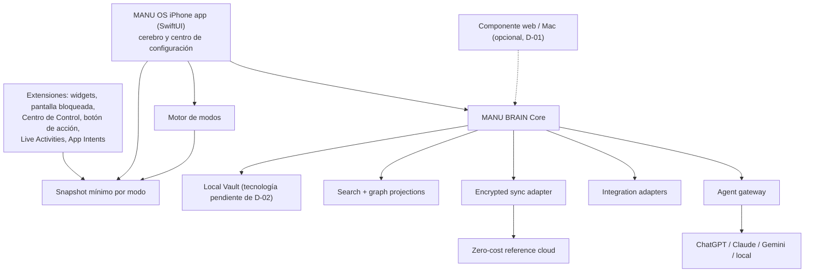

# 02 — Arquitectura

> Revisado el 2026-09-28 por [ADR-0007](../adr/0007-native-iphone-first.md). La app nativa de iPhone es la interfaz principal. Las decisiones BRAIN-00 que dependían de la PWA como interfaz principal se conservan abajo, marcadas como **pendientes de D-01** o **sustituidas**; no se han borrado.

## Vista general

MANU BRAIN Core no depende de ninguna interfaz, nube ni IA. Define comandos, eventos, validación, resolución temporal y exportación. La app nativa, sus extensiones, un posible componente web, la nube y los agentes consumen ese núcleo mediante interfaces.

**Pendiente (D-01)**: el lenguaje y la ubicación del núcleo. BRAIN-00 lo definió como TypeScript. Con la app nativa como interfaz principal hay tres opciones abiertas: núcleo en Swift, núcleo en TypeScript ejecutado en el dispositivo, o contrato compartido (schemas y vectores de test) implementado en ambos lenguajes. La decisión debe tomarse antes de autorizar BRAIN-01.

## Superficies nativas y modos

Todas estas capacidades son `TEÓRICAMENTE_POSIBLE` hasta probarlas en el iPhone de Manu.

| Superficie | Papel en MANU OS | Límites conocidos |
| --- | --- | --- |
| App principal (SwiftUI) | vault, configuración de modos, permisos, integraciones, Inbox, búsqueda | puede ser suspendida por iOS en segundo plano |
| Widgets de inicio y pantalla bloqueada | información del modo activo y accesos directos | actualización con presupuesto del sistema; no son tiempo real; visibles con el iPhone bloqueado |
| App Intents / Atajos / Siri | captura y acciones sin abrir la app; base para botón de acción y automatizaciones | cada acción con efectos externos requiere confirmación |
| Botón de acción | acceso directo a captura o cambio de modo | solo en modelos de iPhone que lo tienen; lo asigna Manu en Ajustes |
| Centro de Control | controles para captura o cambio de modo | disponibilidad según versión de iOS; `NO_VERIFICADO` |
| Live Activities | seguimiento de algo en curso (por ejemplo, bloque de trabajo) | duración limitada por el sistema; visibles con el iPhone bloqueado |
| Focus del sistema | señal de contexto para elegir el modo | Manu configura qué apps y contactos lo atraviesan; MANU OS no puede silenciar otras apps por sí mismo |

Reglas de diseño:

- Las extensiones leen un **snapshot mínimo** preparado por la app para el modo activo, no el vault completo.
- Nada marcado como sensible aparece en superficies visibles con el iPhone bloqueado, salvo permiso explícito de Manu por tipo de dato.
- Los permisos se piden cuando Manu usa por primera vez la función que los necesita, con un texto que explica para qué.
- El motor de modos es determinista y explicable: cada modo declara su horario o disparador, qué muestra y qué excepciones tiene. La IA puede proponer cambios de modo, no aplicarlos.
- Si una superficie no está disponible (versión de iOS, modelo de iPhone o permiso retirado), la función sigue siendo accesible desde la app.

## Componentes decididos

> Esta tabla es la decisión BRAIN-00, cuando la PWA era la interfaz principal. Las filas marcadas **(D-01)** o **(D-02)** quedan pendientes de revisión por ADR-0007; el resto sigue vigente.

| Capa | Decisión BRAIN-00 | Motivo |
| --- | --- | --- |
| UI | **Sustituida (ADR-0007)**: app nativa SwiftUI para iPhone. Antes: React + TypeScript + Vite PWA. Un componente web solo si D-01 lo mantiene | las superficies del sistema solo están disponibles en nativo |
| Estilo | **(D-01)** En nativo: componentes del sistema, Dynamic Type y modo oscuro. CSS propio con tokens solo para un componente web | seguir las convenciones de iOS |
| Estado local | **(D-02)** Adaptador `LocalStore`. BRAIN-00: IndexedDB + Dexie (válido solo para un componente web) | la tecnología nativa y el contenedor compartido con extensiones están por decidir |
| Blobs locales | **(D-02)** BRAIN-00: OPFS con fallback a IndexedDB (solo web) | archivos sin inflar registros estructurados |
| Dominio | **(D-01)** BRAIN-00: paquetes TypeScript + Zod | contratos ejecutables y compartidos; el lenguaje depende de D-01 |
| API | estándar Fetch; implementación de referencia en Cloudflare Workers | portable y con free tier suficiente |
| Metadatos de servicio | D1/SQLite | auth, dispositivos, cursores y cuotas; nunca corpus en claro |
| Sync | event log cifrado, incremental y reintentable | auditable, recuperable y compatible con varios backends |
| Blobs remotos | adaptador; candidato V1 Google Drive `appDataFolder` cifrado | usa cuota existente y scope no sensible |
| Grafo | proyección relacional de afirmaciones y relaciones | evita una base especializada prematura |
| Búsqueda | índice textual local; Postgres/SQLite FTS solo en adaptadores compatibles | funciona offline y sin IA |
| Embeddings | desactivados en MVP | coste, privacidad y poca necesidad inicial |
| Auth | passkey/WebAuthn + sesión segura; recuperación separada. En nativo, desbloqueo local con biometría del sistema **(D-02)** | sin contraseña reutilizable |
| Cifrado | AES-256-GCM; clave maestra local envuelta por secreto de recuperación. Implementación: Web Crypto en web; en nativo, pendiente de D-02 (candidatos a verificar: CryptoKit y Keychain) | nube sin contenido legible |
| Monorepo | **(D-01)** BRAIN-00: pnpm workspaces, sin Turborepo. Con app nativa hace falta además un proyecto Xcode o Swift Package | menos herramientas y menor mantenimiento |

Las marcas de librería son decisiones iniciales, no contratos permanentes. Los puertos `LocalStore`, `BlobStore`, `SyncTransport`, `SearchIndex`, `IntegrationAdapter` y `AgentAdapter` impiden acoplar el cerebro.

## Local-first y sincronización

### Flujo de escritura

1. La app (o una extensión, mediante App Intent) valida un comando.
2. MANU BRAIN crea un evento inmutable con UUIDv7, `device_id`, reloj lógico y fecha del dispositivo.
3. El evento y el estado materializado se guardan localmente en una transacción.
4. El contenido destinado a sync se cifra en el cliente.
5. Cuando hay red y la app está activa, el adaptador envía lotes idempotentes.
6. El servidor o Drive guarda ciphertext y metadatos mínimos.
7. Otros dispositivos descargan eventos, verifican integridad y materializan el mismo resultado.

No se promete sincronización en background en iPhone. En la app nativa, iOS decide cuándo concede tiempo en segundo plano, así que no se puede garantizar. La estrategia base es sincronizar al abrir la app, al volver a primer plano, al recuperar conectividad y con refresh manual; la ejecución en segundo plano del sistema es una mejora oportunista, no un requisito. (BRAIN-00 formuló esta regla para Safari/PWA, que no tiene Background Sync general; la regla sigue siendo válida para un componente web.)

### Conflictos

- Texto bruto y adjuntos: inmutables; no entran en conflicto.
- Campos escalares: last-writer-wins por reloj híbrido, conservando el valor anterior y su evento.
- Tags y relaciones: operaciones add/remove con identificadores, no reemplazo de lista completa.
- Decisiones y afirmaciones: nunca se fusionan silenciosamente; se crea conflicto visible o una relación `SUPERSEDED_BY`.
- Borrado: tombstone sincronizable; purga física solo tras ventana de recuperación y backup.

No se introduce CRDT genérico en el MVP. Si la edición colaborativa o multidispositivo concurrente demuestra necesitarlo, se evaluará Automerge/Yjs detrás del mismo contrato.

## Cifrado y claves

- Cada vault tiene una Data Encryption Key aleatoria de 256 bits.
- Los registros y blobs se cifran con AES-256-GCM y nonce único.
- La clave de datos se envuelve con una Key Encryption Key derivada de una frase/secreto de recuperación usando Argon2id con parámetros versionados (BRAIN-00: Argon2id WASM para web; implementación nativa pendiente de D-02).
- Las extensiones solo reciben el snapshot mínimo del modo activo; qué parte de ese snapshot puede leerse con el iPhone bloqueado se decide por tipo de dato (ver `docs/security/THREAT_MODEL.md`).
- El servidor nunca recibe la clave de datos ni la frase de recuperación.
- La clave descifrada vive en memoria durante la sesión.
- Se ofrece bloqueo local y cierre automático configurables.
- La búsqueda e inferencia sobre el corpus ocurren en el dispositivo mientras el vault está abierto.

El uso de passkeys autentica al usuario ante el servicio, pero no sustituye el secreto de recuperación del cifrado. No se basará el cifrado en extensiones WebAuthn que no estén probadas en los dispositivos reales.

## Despliegue de coste 0 €

### Base inmediata

- GitHub privado para código.
- GitHub Actions con presupuesto/límite de gasto en 0 € y workflows breves.
- PWA estática en Cloudflare Pages/Workers Free o GitHub Pages durante desarrollo (solo si D-01 mantiene un componente web).
- App iOS: instalación personal desde Xcode; coste y caducidad de la instalación pendientes de D-03.
- Worker Free para OAuth, auth y sync ligero: 100.000 requests/día documentadas.
- D1 Free para datos de servicio: 500 MB por base y 5 GB por cuenta; al superar límites diarios devuelve error en lugar de ejecutar consultas.
- Google Drive `appDataFolder` como opción de blobs/eventos cifrados; consume la cuota de Drive del usuario.

### Barreras de gasto

- No asociar método de pago a servicios del MVP cuando sea evitable.
- No activar Workers Paid, R2 de pago, Supabase Pro, APIs de IA ni Google Maps Platform.
- CI con presupuesto 0 y alertas; el exceso debe detener jobs.
- Feature flag `cloudSync=false` hasta que OAuth y restauración estén probados.
- Métricas locales de cuota y mensaje claro de «sync temporalmente pausado».

R2 tiene una franquicia gratuita amplia, pero cobra por exceso en cuentas facturables. Por tanto queda **fuera del MVP** salvo que exista un límite duro de gasto verificado en la cuenta. Supabase no es la base elegida: su free tier puede pausarse y el plan de pago introduce facturación; se mantiene como adaptador futuro, no como dependencia.

## iPhone + Mac

### App nativa de iPhone (ADR-0007)

- app SwiftUI como cerebro y centro de configuración: vault, modos, permisos, integraciones, Inbox y búsqueda;
- extensiones: widgets de inicio y pantalla bloqueada, App Intents (Atajos, Siri y botón de acción), controles del Centro de Control y Live Activities;
- Share Extension para capturar desde otras apps;
- acceso con permiso, pedido en el momento de uso, a calendario y recordatorios, fotos, micrófono y reconocimiento de voz;
- datos compartidos con las extensiones mediante un contenedor común limitado al snapshot mínimo **(D-02)**;
- Dynamic Type, VoiceOver, modo oscuro y convenciones de navegación de iOS desde el primer incremento.

Nada de esta lista está implementado ni probado.

### Mac

Pendiente de D-01. Opciones: el componente web existente, una app SwiftUI para macOS que comparta código con la de iPhone, o solo acceso a exports y backups. BRAIN-00 asumía la PWA también en Mac.

### Distribución y aprovisionamiento (D-03, D-04)

BRAIN-00 registró que una cuenta Apple gratuita permite instalar builds personales con perfiles que caducan a los 7 días, y que la distribución y las capacidades avanzadas requieren Apple Developer Program (99 USD/año). Con la app nativa en el MVP, esto deja de ser un detalle futuro:

- **D-03**: decidir si Manu asume Apple Developer Program. Hay que verificar qué capacidades usadas por MANU OS (widgets, App Intents, Live Activities, contenedor compartido con extensiones, notificaciones) funcionan con una cuenta gratuita y cuáles no. `NO_VERIFICADO`; el precio y las condiciones deben comprobarse en la documentación actual de Apple.
- **D-04**: compilar y probar la app requiere Xcode en un Mac. El entorno de Claude Code en la nube es Linux y no puede compilar ni ejecutar la app iOS; la verificación en dispositivo la hará Manu o un runner de macOS con coste validado contra ADR-0004.

### PWA V1 (BRAIN-00, sustituida como interfaz principal por ADR-0007)

Se conserva como referencia si D-01 mantiene un componente web:

- manifest, iconos, display standalone, theme color y safe areas;
- service worker con app shell offline;
- IndexedDB/OPFS, cámara y selector de archivos bajo acción del usuario;
- Web Push solo para notificaciones genéricas y tras permiso explícito;
- navegación por gestos sin bloquear accesibilidad;
- instalación guiada desde Safari;
- Atajo «Capturar en MANU OS» que recibe Share Sheet y hace POST a un endpoint autenticado o abre un deep link de captura.

### Companion nativo futuro (BRAIN-00, sustituido por ADR-0007)

> Texto original conservado por trazabilidad. La app nativa ya no es un companion futuro sino la interfaz principal.

Un shell Swift/SwiftUI pequeño podrá aportar Share Extension, EventKit, Contacts, PhotoPicker, HealthKit, App Intents y mejor background execution. No reimplementará MANU BRAIN: llamará al mismo dominio o intercambiará paquetes/versiones mediante un bridge definido.

Una cuenta Apple gratuita permite instalar builds personales, pero los perfiles caducan a los 7 días; distribución y capacidades avanzadas requieren Apple Developer Program (99 USD/año). Por eso no es requisito del MVP. *(Sustituido: ver «Distribución y aprovisionamiento».)*

La regla «no reimplementar MANU BRAIN» sigue vigente: si D-01 elige dos implementaciones del núcleo, ambas deben pasar los mismos vectores de test.

## Capa de agentes y MCP

MIRROR y los agentes usan un `AgentGateway` con cuatro operaciones lógicas:

- `search_knowledge(query, filters)`
- `get_evidence(claim_id)`
- `propose_claims(source_ids)`
- `propose_action(action)`

Lecturas pueden automatizarse con auditoría. Escrituras siempre producen una propuesta revisable; acciones externas destructivas o comunicativas requieren aprobación explícita.

MCP será una interfaz opcional para exponer herramientas de MANU BRAIN a Claude, ChatGPT, Gemini u otros clientes. El servidor MCP no será el almacén. Debe aplicar scopes, herramientas permitidas, redacción, aprobación y log de datos compartidos. Solo se conectarán servidores oficiales o auditados; el prompt injection procedente de archivos se trata como dato, no como instrucción.

## Importación

Todo importador tiene dos fases:

1. **Preservar**: guardar bytes originales, hash, manifiesto, origen, autor y fechas.
2. **Derivar**: parsear en fragmentos y proponer entidades/afirmaciones. El resultado puede borrarse y regenerarse sin perder el original.

ChatGPT: importador versionado de `conversations.json` o archivos equivalentes dentro del ZIP.  
Claude: importador versionado de la exportación descargada.  
Google Workspace: sincronizadores por API con cursores y scopes incrementales, nunca un volcado opaco.

Los parsers se basan en fixtures anonimizados; un cambio de formato debe fallar de forma visible y conservar el archivo.
