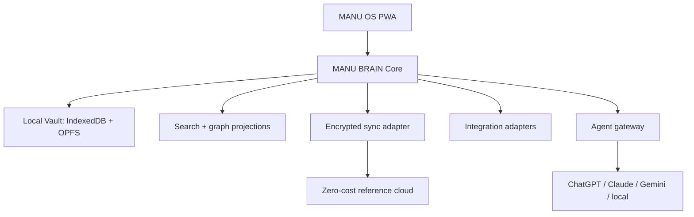

# 02 — Arquitectura

## Vista general

MANU BRAIN Core es TypeScript sin dependencias de React, Cloudflare, Google ni una IA. Define comandos, eventos, validación, resolución temporal y exportación. La PWA, la nube y los agentes consumen ese núcleo mediante interfaces.

## Componentes decididos

| Capa | Decisión BRAIN-00 | Motivo |
| --- | --- | --- |
| UI | React + TypeScript + Vite PWA | ecosistema estable, rápido y portable |
| Estilo | CSS propio con tokens; sin framework visual pesado | aspecto Apple-like sin plantilla SaaS |
| Estado local | IndexedDB mediante un adaptador (implementación inicial: Dexie) | soporte maduro y offline en Safari |
| Blobs locales | OPFS cuando esté disponible; fallback a IndexedDB | archivos sin inflar registros estructurados |
| Dominio | paquetes TypeScript + Zod | contratos ejecutables y compartidos |
| API | estándar Fetch; implementación de referencia en Cloudflare Workers | portable y con free tier suficiente |
| Metadatos de servicio | D1/SQLite | auth, dispositivos, cursores y cuotas; nunca corpus en claro |
| Sync | event log cifrado, incremental y reintentable | auditable, recuperable y compatible con varios backends |
| Blobs remotos | adaptador; candidato V1 Google Drive `appDataFolder` cifrado | usa cuota existente y scope no sensible |
| Grafo | proyección relacional de afirmaciones y relaciones | evita una base especializada prematura |
| Búsqueda | índice textual local; Postgres/SQLite FTS solo en adaptadores compatibles | funciona offline y sin IA |
| Embeddings | desactivados en MVP | coste, privacidad y poca necesidad inicial |
| Auth | passkey/WebAuthn + sesión segura; recuperación separada | sin contraseña reutilizable |
| Cifrado | Web Crypto, AES-GCM; clave maestra local envuelta por secreto de recuperación | nube sin contenido legible |
| Monorepo | pnpm workspaces, sin Turborepo inicialmente | menos herramientas y menor mantenimiento |

Las marcas de librería son decisiones iniciales, no contratos permanentes. Los puertos `LocalStore`, `BlobStore`, `SyncTransport`, `SearchIndex`, `IntegrationAdapter` y `AgentAdapter` impiden acoplar el cerebro.

## Local-first y sincronización

### Flujo de escritura

1. La PWA valida un comando.
2. MANU BRAIN crea un evento inmutable con UUIDv7, `device_id`, reloj lógico y fecha del dispositivo.
3. El evento y el estado materializado se guardan localmente en una transacción.
4. El contenido destinado a sync se cifra en el cliente.
5. Cuando hay red y la app está activa, el adaptador envía lotes idempotentes.
6. El servidor o Drive guarda ciphertext y metadatos mínimos.
7. Otros dispositivos descargan eventos, verifican integridad y materializan el mismo resultado.

No se promete sincronización en background en iPhone. Safari/iOS sigue sin Background Sync general; la estrategia es `online`, `visibilitychange`, apertura, refresh manual y notificación genérica opcional.

### Conflictos

- Texto bruto y adjuntos: inmutables; no entran en conflicto.
- Campos escalares: last-writer-wins por reloj híbrido, conservando el valor anterior y su evento.
- Tags y relaciones: operaciones add/remove con identificadores, no reemplazo de lista completa.
- Decisiones y afirmaciones: nunca se fusionan silenciosamente; se crea conflicto visible o una relación `SUPERSEDED_BY`.
- Borrado: tombstone sincronizable; purga física solo tras ventana de recuperación y backup.

No se introduce CRDT genérico en el MVP. Si la edición colaborativa o multidispositivo concurrente demuestra necesitarlo, se evaluará Automerge/Yjs detrás del mismo contrato.

## Cifrado y claves

- Cada vault tiene una Data Encryption Key aleatoria de 256 bits.
- Los registros y blobs se cifran con AES-256-GCM y nonce único.
- La clave de datos se envuelve con una Key Encryption Key derivada de una frase/secreto de recuperación usando Argon2id (WASM) con parámetros versionados.
- El servidor nunca recibe la clave de datos ni la frase de recuperación.
- La clave descifrada vive en memoria durante la sesión.
- Se ofrece bloqueo local y cierre automático configurables.
- La búsqueda e inferencia sobre el corpus ocurren en el dispositivo mientras el vault está abierto.

El uso de passkeys autentica al usuario ante el servicio, pero no sustituye el secreto de recuperación del cifrado. No se basará el cifrado en extensiones WebAuthn que no estén probadas en los dispositivos reales.

## Despliegue de coste 0 €

### Base inmediata

- GitHub privado para código.
- GitHub Actions con presupuesto/límite de gasto en 0 € y workflows breves.
- PWA estática en Cloudflare Pages/Workers Free o GitHub Pages durante desarrollo.
- Worker Free para OAuth, auth y sync ligero: 100.000 requests/día documentadas.
- D1 Free para datos de servicio: 500 MB por base y 5 GB por cuenta; al superar límites diarios devuelve error en lugar de ejecutar consultas.
- Google Drive `appDataFolder` como opción de blobs/eventos cifrados; consume la cuota de Drive del usuario.

### Barreras de gasto

- No asociar método de pago a servicios del MVP cuando sea evitable.
- No activar Workers Paid, R2 de pago, Supabase Pro, APIs de IA ni Google Maps Platform.
- CI con presupuesto 0 y alertas; el exceso debe detener jobs.
- Feature flag `cloudSync=false` hasta que OAuth y restauración estén probados.
- Métricas locales de cuota y mensaje claro de «sync temporalmente pausado».

R2 tiene una franquicia gratuita amplia, pero cobra por exceso en cuentas facturables. Por tanto queda **fuera del MVP** salvo que exista un límite duro de gasto verificado en la cuenta. Supabase no es la base elegida: su free tier puede pausarse y el plan de pago introduce facturación; se mantiene como adaptador futuro, no como dependencia.

## iPhone + Mac

### PWA V1

- manifest, iconos, display standalone, theme color y safe areas;
- service worker con app shell offline;
- IndexedDB/OPFS, cámara y selector de archivos bajo acción del usuario;
- Web Push solo para notificaciones genéricas y tras permiso explícito;
- navegación por gestos sin bloquear accesibilidad;
- instalación guiada desde Safari;
- Atajo «Capturar en MANU OS» que recibe Share Sheet y hace POST a un endpoint autenticado o abre un deep link de captura.

### Companion nativo futuro

Un shell Swift/SwiftUI pequeño podrá aportar Share Extension, EventKit, Contacts, PhotoPicker, HealthKit, App Intents y mejor background execution. No reimplementará MANU BRAIN: llamará al mismo dominio o intercambiará paquetes/versiones mediante un bridge definido.

Una cuenta Apple gratuita permite instalar builds personales, pero los perfiles caducan a los 7 días; distribución y capacidades avanzadas requieren Apple Developer Program (99 USD/año). Por eso no es requisito del MVP.

## Capa de agentes y MCP

MIRROR y los agentes usan un `AgentGateway` con cuatro operaciones lógicas:

- `search_knowledge(query, filters)`
- `get_evidence(claim_id)`
- `propose_claims(source_ids)`
- `propose_action(action)`

Lecturas pueden automatizarse con auditoría. Escrituras siempre producen una propuesta revisable; acciones externas destructivas o comunicativas requieren aprobación explícita.

MCP será una interfaz opcional para exponer herramientas de MANU BRAIN a Claude, ChatGPT, Gemini u otros clientes. El servidor MCP no será el almacén. Debe aplicar scopes, herramientas permitidas, redacción, aprobación y log de datos compartidos. Solo se conectarán servidores oficiales o auditados; el prompt injection procedente de archivos se trata como dato, no como instrucción.

## Importación

Todo importador tiene dos fases:

1. **Preservar**: guardar bytes originales, hash, manifiesto, origen, autor y fechas.
2. **Derivar**: parsear en fragmentos y proponer entidades/afirmaciones. El resultado puede borrarse y regenerarse sin perder el original.

ChatGPT: importador versionado de `conversations.json` o archivos equivalentes dentro del ZIP.  
Claude: importador versionado de la exportación descargada.  
Google Workspace: sincronizadores por API con cursores y scopes incrementales, nunca un volcado opaco.

Los parsers se basan en fixtures anonimizados; un cambio de formato debe fallar de forma visible y conservar el archivo.
