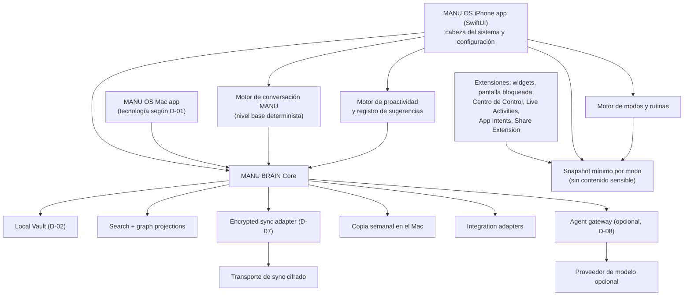

# 02 — Arquitectura

> Revisado el 2026-09-28 por [ADR-0007](../adr/0007-native-iphone-first.md) y, el mismo día, por las decisiones de producto de Manu ([ADR-0008](../adr/0008-source-retention-and-controlled-deletion.md), [ADR-0009](../adr/0009-manu-assistant-without-mandatory-ai.md), `docs/product/EXPERIENCE.md`). Las decisiones anteriores que cambian se conservan marcadas como **pendientes** o **sustituidas**.

## Vista general

MANU BRAIN Core no depende de ninguna interfaz, nube ni IA. Define comandos, eventos, validación, resolución temporal, retención y exportación. Las apps, sus extensiones, la sincronización y los agentes consumen ese núcleo mediante interfaces.

**DECIDIDO (D-01, 2026-09-28)**: núcleo MANU BRAIN en Swift y apps SwiftUI para iPhone y Mac, sin duplicar el núcleo en TypeScript y sin componente web en la Beta 1. BRAIN-01 se implementará como Swift Package independiente de la interfaz.

## Superficies nativas y modos

Todas estas capacidades son `TEÓRICAMENTE_POSIBLE` hasta probarlas en el iPhone de Manu.

| Superficie | Papel en MANU OS | Límites conocidos |
| --- | --- | --- |
| App principal (SwiftUI) | vault, configuración de modos, permisos, integraciones, Inbox, búsqueda | puede ser suspendida por iOS en segundo plano |
| Widgets de inicio y pantalla bloqueada | información del modo activo y accesos directos | actualización con presupuesto del sistema; no son tiempo real; visibles con el iPhone bloqueado |
| App Intents / Atajos / Siri | captura y acciones sin abrir la app; base para botón de acción y automatizaciones | cada acción con efectos externos requiere confirmación |
| Botón de acción | abrir el chat de MANU | **no existe en el iPhone 14** (según Apple, solo iPhone 15 Pro y posteriores). Aplicable si Manu cambia de iPhone |
| Centro de Control y controles de pantalla bloqueada | hablar con MANU, guardar una idea, registrar un gasto | controles de terceros desde iOS 18 (WidgetKit); requieren SDK de iOS 18 o posterior (D-04); `NO_VERIFICADO` en el iPhone de Manu |
| Toque posterior (Accesibilidad) + Atajo | alternativa al botón de acción para abrir MANU | `NO_VERIFICADO`; lo configura Manu |
| Live Activities | seguimiento de algo en curso (por ejemplo, bloque de trabajo) | duración limitada por el sistema; visibles con el iPhone bloqueado |
| Focus del sistema | señal de contexto para elegir el modo | Manu configura qué apps y contactos lo atraviesan; MANU OS no puede silenciar otras apps por sí mismo |

Reglas de diseño:

- Las extensiones leen un **snapshot mínimo** preparado por la app para el modo activo, no el vault completo.
- Nada marcado como sensible aparece en superficies visibles con el iPhone bloqueado, salvo permiso explícito de Manu por tipo de dato.
- Los permisos se piden cuando Manu usa por primera vez la función que los necesita, con un texto que explica para qué.
- El motor de modos es determinista y explicable: cada modo declara su horario o disparador, qué muestra y qué excepciones tiene. La IA puede proponer cambios de modo, no aplicarlos.
- Los modos cambian contenido y comportamiento, **no la apariencia** (colores, fondos y widgets son estables).
- Si una superficie no está disponible (versión de iOS, modelo de iPhone o permiso retirado), la función sigue siendo accesible desde la app.

## Asistente, proactividad y acciones

Decisión en [ADR-0009](../adr/0009-manu-assistant-without-mandatory-ai.md).

- **Motor de conversación (nivel base)**: reconoce intenciones de forma determinista, ejecuta comandos contra MANU BRAIN, responde con plantillas variadas y cita fuentes. Funciona sin red y sin modelo.
- **Nivel conversacional (opcional)**: `AgentAdapter` hacia un proveedor decidido en D-08, con contexto mínimo, registro de divulgación y exclusión por defecto de datos sensibles (G-13).
- **Motor de proactividad**: genera sugerencias a partir de reglas, horarios y patrones aprendidos localmente. Cada sugerencia queda registrada con su resultado (aceptada, rechazada, ignorada) para aprender los momentos adecuados. Respeta Focus, un presupuesto diario de interrupciones y la regla de no repetirse.
- **Niveles de acción**:
  1. lectura y consulta: automáticas;
  2. acciones pequeñas y rutinas **previamente autorizadas** por Manu: automáticas, registradas y reversibles cuando sea posible;
  3. acciones con consecuencias (crear eventos, borrar, gastos, mensajes): se preparan y se confirman;
  4. mensajes automáticos: solo los de una **lista blanca explícita** (candidato único: aviso de llegada, `NO_VERIFICADO`).
- **Puente con apps oficiales**: MANU prepara el contexto, lo muestra y abre ChatGPT, Claude o Gemini; no automatiza sus cuentas.

## Sensibilidad y retención

- Cada dato lleva una **etiqueta de sensibilidad** (ver `DATA_MODEL.md`). Lo sensible (salud, finanzas, estado emocional, datos de terceros, capturas marcadas) se procesa localmente igual que lo demás, pero no entra en el snapshot de las extensiones, en notificaciones visibles ni en exportaciones compartibles.
- Cada fuente tiene una **política de retención** (`FULL`, `EXTRACTED_ONLY`, `REFERENCE_ONLY`, `TRANSIENT`) según ADR-0008. La bandeja diaria de capturas usa `EXTRACTED_ONLY` y el audio de respuesta, `TRANSIENT`.
- La petición de borrado en Fotos es una acción destructiva externa: se confirma en MANU OS, iOS muestra su propia confirmación y se registra el resultado real.

## Componentes decididos

> Esta tabla es la decisión BRAIN-00, cuando la PWA era la interfaz principal. Las filas marcadas **(D-01)** o **(D-02)** quedan pendientes de revisión por ADR-0007; el resto sigue vigente.

| Capa | Decisión BRAIN-00 | Motivo |
| --- | --- | --- |
| UI | **Sustituida (ADR-0007)**: app nativa SwiftUI para iPhone. Antes: React + TypeScript + Vite PWA. Un componente web solo si D-01 lo mantiene | las superficies del sistema solo están disponibles en nativo |
| Estilo | **(D-01)** En nativo: componentes del sistema, Dynamic Type y modo oscuro. CSS propio con tokens solo para un componente web | seguir las convenciones de iOS |
| Estado local | **(D-02)** Adaptador `LocalStore`. BRAIN-00: IndexedDB + Dexie (válido solo para un componente web) | la tecnología nativa y el contenedor compartido con extensiones están por decidir |
| Blobs locales | **(D-02)** BRAIN-00: OPFS con fallback a IndexedDB (solo web) | archivos sin inflar registros estructurados |
| Dominio | **(D-01)** BRAIN-00: paquetes TypeScript + Zod | contratos ejecutables y compartidos; el lenguaje depende de D-01 |
| API | estándar Fetch; implementación de referencia en Cloudflare Workers | portable y con free tier suficiente |
| Metadatos de servicio | D1/SQLite | auth, dispositivos, cursores y cuotas; nunca corpus en claro |
| Sync | event log cifrado, incremental y reintentable | auditable, recuperable y compatible con varios backends |
| Blobs remotos | adaptador; candidato V1 Google Drive `appDataFolder` cifrado | usa cuota existente y scope no sensible |
| Grafo | proyección relacional de afirmaciones y relaciones | evita una base especializada prematura |
| Búsqueda | índice textual local; Postgres/SQLite FTS solo en adaptadores compatibles | funciona offline y sin IA |
| Embeddings | desactivados en MVP | coste, privacidad y poca necesidad inicial |
| Auth | passkey/WebAuthn + sesión segura; recuperación separada. En nativo, **sin bloqueo interno de Face ID** (decisión de Manu, 2026-09-28): la protección local depende del bloqueo del dispositivo y del cifrado. *(Sustituye a «desbloqueo local con biometría», anotado antes como D-02.)* | sin contraseña reutilizable; menos fricción |
| Cifrado | AES-256-GCM; clave maestra local envuelta por secreto de recuperación. Implementación: Web Crypto en web; en nativo, pendiente de D-02 (candidatos a verificar: CryptoKit y Keychain) | nube sin contenido legible |
| Monorepo | **(D-01)** BRAIN-00: pnpm workspaces, sin Turborepo. Con app nativa hace falta además un proyecto Xcode o Swift Package | menos herramientas y menor mantenimiento |

Las marcas de librería son decisiones iniciales, no contratos permanentes. Los puertos `LocalStore`, `BlobStore`, `SyncTransport`, `SearchIndex`, `IntegrationAdapter` y `AgentAdapter` impiden acoplar el cerebro.

## Local-first y sincronización

### Flujo de escritura

1. La app (o una extensión, mediante App Intent) valida un comando.
2. MANU BRAIN crea un evento inmutable con UUIDv7, `device_id`, reloj lógico y fecha del dispositivo.
3. El evento y el estado materializado se guardan localmente en una transacción.
4. El contenido destinado a sync se cifra en el cliente.
5. Cuando hay red y la app está activa, el adaptador envía lotes idempotentes.
6. El servidor o Drive guarda ciphertext y metadatos mínimos.
7. Otros dispositivos descargan eventos, verifican integridad y materializan el mismo resultado.

No se promete sincronización en background en iPhone. En la app nativa, iOS decide cuándo concede tiempo en segundo plano, así que no se puede garantizar. La estrategia base es sincronizar al abrir la app, al volver a primer plano, al recuperar conectividad y con refresh manual; la ejecución en segundo plano del sistema es una mejora oportunista, no un requisito. (BRAIN-00 formuló esta regla para Safari/PWA, que no tiene Background Sync general; la regla sigue siendo válida para un componente web.)

### Conflictos

- Texto bruto y adjuntos: inmutables; no entran en conflicto.
- Campos escalares: last-writer-wins por reloj híbrido, conservando el valor anterior y su evento.
- Tags y relaciones: operaciones add/remove con identificadores, no reemplazo de lista completa.
- Decisiones y afirmaciones: nunca se fusionan silenciosamente; se crea conflicto visible o una relación `SUPERSEDED_BY`.
- Borrado: tombstone sincronizable; purga física solo tras ventana de recuperación y backup.

No se introduce CRDT genérico en el MVP. Si la edición colaborativa o multidispositivo concurrente demuestra necesitarlo, se evaluará Automerge/Yjs detrás del mismo contrato.

### Sincronización iPhone ↔ Mac y copias (preferencias de Manu, 2026-09-28)

- Sincronización automática cifrada entre iPhone y Mac. Transporte pendiente de **D-07**. Candidatos: Google Drive `appDataFolder` (ya evaluado), un servicio mínimo propio (Worker/D1) o un servicio de Apple; el uso de servicios de Apple desde una app propia puede requerir Apple Developer Program (`NO_VERIFICADO`, D-03).
- **Copia completa semanal en el Mac**, cifrada, generada por la app de Mac.
- **Restaurar un iPhone nuevo desde el Mac** a partir de esa copia.
- **Copia manual por cable** como opción adicional (`NO_VERIFICADO`: ruta concreta por definir, por ejemplo intercambio de archivos con la app).
- La copia semanal no sustituye al gate G-01: debe restaurarse en una instalación limpia antes de declararse funcional.

## Cifrado y claves

- Cada vault tiene una Data Encryption Key aleatoria de 256 bits.
- Los registros y blobs se cifran con AES-256-GCM y nonce único.
- La clave de datos se envuelve con una Key Encryption Key derivada de una frase/secreto de recuperación usando Argon2id con parámetros versionados (BRAIN-00: Argon2id WASM para web; implementación nativa pendiente de D-02).
- Las extensiones solo reciben el snapshot mínimo del modo activo; qué parte de ese snapshot puede leerse con el iPhone bloqueado se decide por tipo de dato (ver `docs/security/THREAT_MODEL.md`).
- El servidor nunca recibe la clave de datos ni la frase de recuperación.
- La clave descifrada vive en memoria durante la sesión. En nativo, la clave local se guarda en el almacén seguro del sistema con acceso limitado a este dispositivo (detalle en D-02, `NO_VERIFICADO`).
- ~~Se ofrece bloqueo local y cierre automático configurables.~~ Sustituido (2026-09-28): Manu no quiere bloqueos internos de Face ID. No hay bloqueo interno por defecto; el riesgo residual está en R-33.
- La búsqueda e inferencia sobre el corpus ocurren en el dispositivo mientras el vault está abierto.

El uso de passkeys autentica al usuario ante el servicio, pero no sustituye el secreto de recuperación del cifrado. No se basará el cifrado en extensiones WebAuthn que no estén probadas en los dispositivos reales.

## Despliegue de coste 0 €

### Base inmediata

- GitHub privado para código.
- GitHub Actions con presupuesto/límite de gasto en 0 € y workflows breves.
- PWA estática en Cloudflare Pages/Workers Free o GitHub Pages durante desarrollo (solo si D-01 mantiene un componente web).
- App iOS: instalación personal desde Xcode; coste y caducidad de la instalación pendientes de D-03.
- Worker Free para OAuth, auth y sync ligero: 100.000 requests/día documentadas.
- D1 Free para datos de servicio: 500 MB por base y 5 GB por cuenta; al superar límites diarios devuelve error en lugar de ejecutar consultas.
- Google Drive `appDataFolder` como opción de blobs/eventos cifrados; consume la cuota de Drive del usuario.

### Barreras de gasto

- No asociar método de pago a servicios del MVP cuando sea evitable.
- No activar Workers Paid, R2 de pago, Supabase Pro, APIs de IA ni Google Maps Platform.
- CI con presupuesto 0 y alertas; el exceso debe detener jobs.
- Feature flag `cloudSync=false` hasta que OAuth y restauración estén probados.
- Métricas locales de cuota y mensaje claro de «sync temporalmente pausado».

R2 tiene una franquicia gratuita amplia, pero cobra por exceso en cuentas facturables. Por tanto queda **fuera del MVP** salvo que exista un límite duro de gasto verificado en la cuenta. Supabase no es la base elegida: su free tier puede pausarse y el plan de pago introduce facturación; se mantiene como adaptador futuro, no como dependencia.

## iPhone + Mac

### App nativa de iPhone (ADR-0007)

- app SwiftUI como cerebro y centro de configuración: vault, modos, permisos, integraciones, Inbox y búsqueda;
- extensiones: widgets de inicio y pantalla bloqueada, App Intents (Atajos y Siri; botón de acción solo en iPhones que lo tengan), controles del Centro de Control y Live Activities (el iPhone 14 estándar no tiene Dynamic Island, así que se verían en la pantalla bloqueada; confirmar el modelo exacto);
- Share Extension para capturar desde otras apps;
- acceso con permiso, pedido en el momento de uso, a calendario y recordatorios, fotos, micrófono y reconocimiento de voz;
- datos compartidos con las extensiones mediante un contenedor común limitado al snapshot mínimo **(D-02)**;
- Dynamic Type, VoiceOver, modo oscuro y convenciones de navegación de iOS desde el primer incremento.

Nada de esta lista está implementado ni probado.

### Mac

Requisito de Manu (2026-09-28): la app de Mac hace lo mismo que la de iPhone (hablar con MANU, proyectos y tareas, archivos y chats, finanzas e informes, configuración de automatizaciones), además de alojar la copia semanal.

Decisión D-01: app SwiftUI para macOS que comparte el núcleo Swift con la de iPhone. El Mac actual es un **MacBook Pro 13 pulgadas de 2017 (`MacBookPro14,2`), Intel i5 de doble núcleo, 8 GB**, con Sonoma 14.8.7 en una configuración no soportada oficialmente por Apple. La app de Mac deberá fijar un deployment target compatible con ese equipo o aplazarse si la compatibilidad perjudica la Beta 1.

### Distribución y aprovisionamiento (D-03, D-04)

Datos de la documentación de Apple consultada el 2026-09-28 (ver `docs/research/SOURCES.md`):

- Con una cuenta gratuita (Personal Team) se puede probar en el propio dispositivo desde Xcode, con estos límites: hasta 10 App IDs y 3 dispositivos, registros que caducan a los 7 días, y perfiles de aprovisionamiento que también caducan a los 7 días, obligando a recompilar y reinstalar. Cada extensión (widgets, controles, Share Extension, intents) suele necesitar su propio App ID, así que MANU OS puede acercarse al límite de 10 (`NO_VERIFICADO`).
- TestFlight, App Store Connect y la notarización de apps de Mac requieren Apple Developer Program.
- WeatherKit requiere Apple Developer Program (incluye 500.000 llamadas al mes por membresía).
- Todas las versiones actuales de Xcode (26.4.1 a 27.2 beta) requieren **macOS Tahoe 26.2 o posterior**.
- Según Apple, macOS Tahoe 26 solo es compatible con Macs con Apple silicon y unos pocos Intel recientes (MacBook Pro de 16 pulgadas de 2019, MacBook Pro de 13 pulgadas de 2020 con cuatro puertos Thunderbolt 3, además de otros modelos de sobremesa). **Un Intel i5 de doble núcleo a 3,1 GHz no parece estar en la lista**, pero hay que confirmarlo con el modelo exacto.

Consecuencias:

- **D-03**: decidir si Manu asume Apple Developer Program. Sin él, la app caduca cada 7 días y algunas capacidades (TestFlight, WeatherKit, posiblemente notificaciones push y servicios de iCloud) no están disponibles. El precio y las condiciones deben comprobarse en la documentación actual de Apple.
- **D-04 (parcialmente resuelta)**: el Mac de Manu no se usa para compilar. BRAIN-01 se compila y prueba como Swift Package en GitHub Actions, runner estándar `macos-26` con Xcode 26.6, presupuesto de gasto 0 € y workflows breves/manuales. Esto no valida la app en el iPhone 14 con iOS 27. Xcode 27 está en vista previa en el runner `xcode-27-xlarge`, no adoptado por coste; la ruta de firma e instalación de la Beta queda como D-04B. No se usará un Mac prestado ni se actualizará este Mac a Tahoe para el proyecto.

### PWA V1 (BRAIN-00, sustituida como interfaz principal por ADR-0007)

Se conserva como referencia si D-01 mantiene un componente web:

- manifest, iconos, display standalone, theme color y safe areas;
- service worker con app shell offline;
- IndexedDB/OPFS, cámara y selector de archivos bajo acción del usuario;
- Web Push solo para notificaciones genéricas y tras permiso explícito;
- navegación por gestos sin bloquear accesibilidad;
- instalación guiada desde Safari;
- Atajo «Capturar en MANU OS» que recibe Share Sheet y hace POST a un endpoint autenticado o abre un deep link de captura.

### Companion nativo futuro (BRAIN-00, sustituido por ADR-0007)

> Texto original conservado por trazabilidad. La app nativa ya no es un companion futuro sino la interfaz principal.

Un shell Swift/SwiftUI pequeño podrá aportar Share Extension, EventKit, Contacts, PhotoPicker, HealthKit, App Intents y mejor background execution. No reimplementará MANU BRAIN: llamará al mismo dominio o intercambiará paquetes/versiones mediante un bridge definido.

Una cuenta Apple gratuita permite instalar builds personales, pero los perfiles caducan a los 7 días; distribución y capacidades avanzadas requieren Apple Developer Program (99 USD/año). Por eso no es requisito del MVP. *(Sustituido: ver «Distribución y aprovisionamiento».)*

La regla «no reimplementar MANU BRAIN» sigue vigente: si D-01 elige dos implementaciones del núcleo, ambas deben pasar los mismos vectores de test.

## Capa de agentes y MCP

El chat MANU en nivel base no usa esta capa (ADR-0009); solo el nivel conversacional opcional pasa por ella. MIRROR y los agentes usan un `AgentGateway` con cuatro operaciones lógicas:

- `search_knowledge(query, filters)`
- `get_evidence(claim_id)`
- `propose_claims(source_ids)`
- `propose_action(action)`

Lecturas pueden automatizarse con auditoría. Escrituras siempre producen una propuesta revisable; acciones externas destructivas o comunicativas requieren aprobación explícita.

MCP será una interfaz opcional para exponer herramientas de MANU BRAIN a Claude, ChatGPT, Gemini u otros clientes. El servidor MCP no será el almacén. Debe aplicar scopes, herramientas permitidas, redacción, aprobación y log de datos compartidos. Solo se conectarán servidores oficiales o auditados; el prompt injection procedente de archivos se trata como dato, no como instrucción.

## Importación

Todo importador tiene dos fases:

1. **Preservar**: guardar bytes originales, hash, manifiesto, origen, autor y fechas. Con retención distinta de `FULL` (ADR-0008), preservar significa guardar procedencia y hash cuando sea posible, no los bytes.
2. **Derivar**: parsear en fragmentos y proponer entidades/afirmaciones. Con retención `FULL`, el resultado puede borrarse y regenerarse sin perder el original. Sin original, los derivados aprobados son la evidencia y no pueden regenerarse.

ChatGPT: importador versionado de `conversations.json` o archivos equivalentes dentro del ZIP.  
Claude: importador versionado de la exportación descargada.  
WhatsApp: importador de exportaciones de chats elegidas por Manu; texto completo cifrado (`FULL`), sin multimedia inicialmente.  
Capturas de pantalla (bandeja diaria): OCR y derivados en el dispositivo; retención `EXTRACTED_ONLY`.  
Google Workspace: sincronizadores por API con cursores y scopes incrementales, nunca un volcado opaco.

Los parsers se basan en fixtures anonimizados; un cambio de formato debe fallar de forma visible y conservar el archivo.
